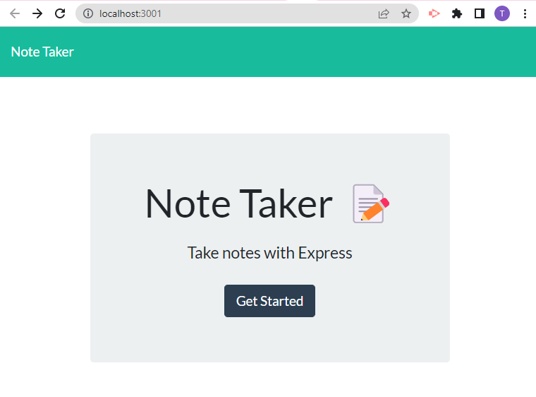

# CH11-Note-Taker

## Table of Contents:
* [Description](https://github.com/T8886/CH11-Note-Taker#description)
* [Mock-Up](https://github.com/T8886/CH11-Note-Taker#mock-up)
* [Build with](https://github.com/T8886/CH11-Note-Taker#build-with)
* [Installation](https://github.com/T8886/CH11-Note-Taker#installation)
* [License](https://github.com/T8886/CH11-Note-Taker#license)

## Description:
Application Note Taker was created to help people become more organized. Individual can enter and save notes. Below is an overview on how application works.

WHEN I open the Note Taker
THEN I am presented with a landing page with a link to a notes page.
WHEN I click on the link to the notes page
THEN I am presented with a page with existing notes listed in the left-hand column, plus empty fields to enter a new note title and the note’s text in the right-hand column.
WHEN I enter a new note title and the note’s text
THEN a Save icon appears in the navigation at the top of the page.
WHEN I click on the Save icon
THEN the new note I have entered is saved and appears in the left-hand column with the other existing notes.
WHEN I click on an existing note in the list in the left-hand column
THEN that note appears in the right-hand column.
WHEN I click on the Write icon in the navigation at the top of the page
THEN I am presented with empty fields to enter a new note title and the note’s text in the right-hand column.

## Mock-Up:
The following images show the web application's appearance and functionality:

! [* Notes that were previously entered are listed in the left-hand column. User can enter Title and text in the middle of the screen. Click button save on a right side of the screen and entered note with teh title will be saved on the right side of the screen.](public/assets/images/2.png)

## Build with:
* JavaScript
* Node.JS - Express

## Installation:
* App can be downloaded through Github
* enter npm i in your terminal to install dependencies 
* enter node server.js in your teminal
* click on http://localhost:3001 to view the app in a browser

## License:
N/A